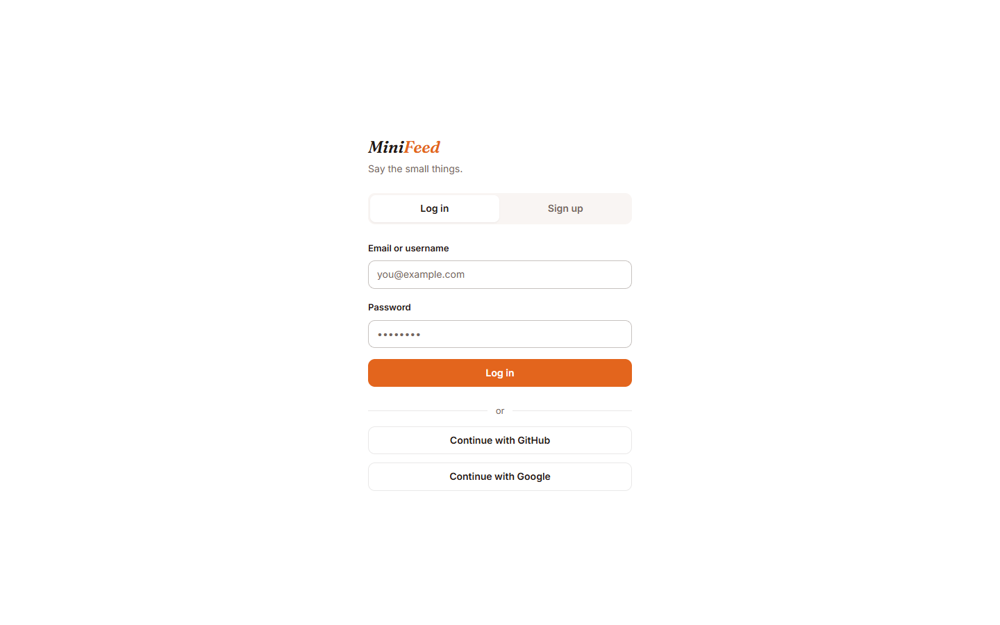
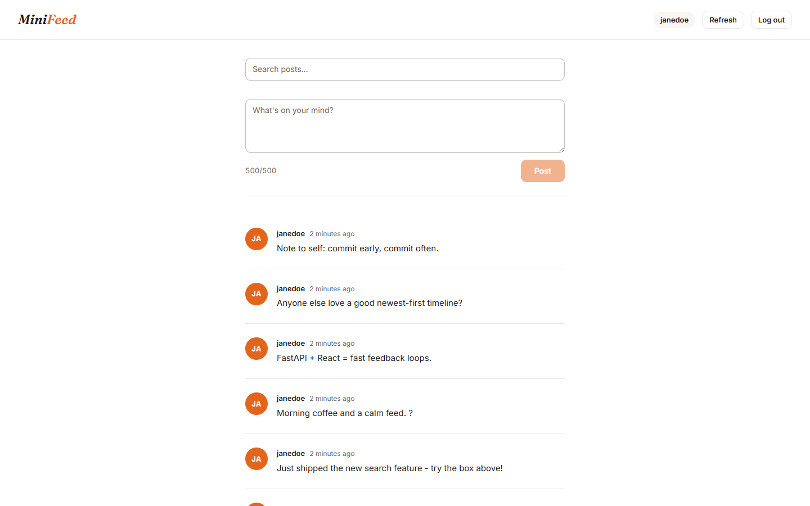
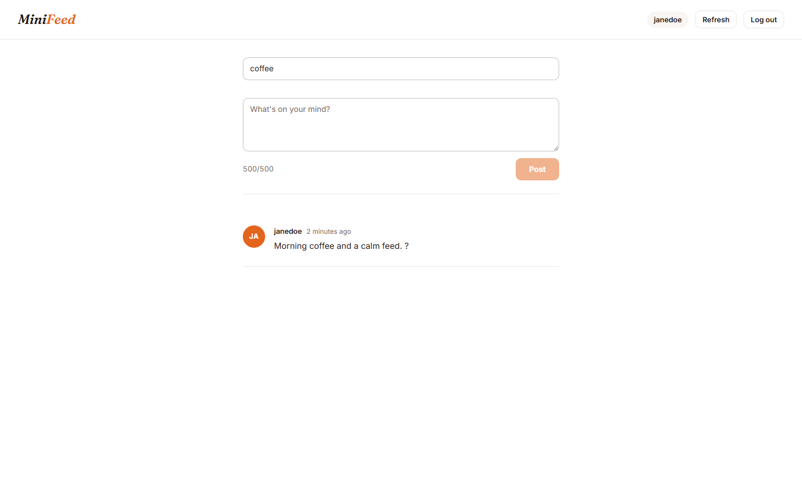

# MiniFeed

A small full-stack social feed built with React + TypeScript and FastAPI.

Users can:

- Sign up and log in
- Create short text posts
- View a newest-first feed

Built for the ET.Verdict Full Stack Developer coding challenge.


---

## Screenshots

### Authentication



### Feed



### Search



---

## Core Features

### Authentication

- User signup and login
- Password hashing with Argon2id
- JWT authentication with expiration
- Protected routes and authenticated API requests

### Social Feed

- Create short text posts
- View all posts
- Newest posts appear first
- Post author information included in feed

### Frontend

- React + TypeScript
- React Router
- Axios API client
- Loading, empty, and error states
- Responsive UI

---

## Additional Engineering

Beyond the core challenge requirements, the project includes several optional improvements:

- GitHub and Google OAuth authentication
- Keyword search for posts
- Request rate limiting
- Redis feed caching with stale-data fallback
- ETag / conditional requests
- Docker and Docker Compose
- Nginx reverse proxy
- Backend and frontend automated tests
- Health checks and graceful error handling

---

## Tech Stack

### Frontend

- React 19
- TypeScript
- Vite
- React Router
- Axios
- CSS / design system

### Backend

- FastAPI
- Python 3.12+
- SQLAlchemy
- Pydantic
- SQLite

### Security

- Argon2id
- JWT
- OAuth 2.0
- Rate limiting

### Testing

- Pytest
- Vitest
- React Testing Library

### Infrastructure

- Docker
- Docker Compose
- Nginx
- Redis

---

## Architecture

```text
Browser
   |
   v
React + TypeScript
   |
   | HTTP / JSON
   v
FastAPI
   |
   +---- SQLAlchemy ----> SQLite
   |
   +---- Redis (optional cache)
```

The Docker setup runs the same application in a more production-style layout:

```text
Docker Compose
├── Nginx
├── Frontend
├── Backend 1
├── Backend 2
├── Redis
└── PostgreSQL
```

---

## Project Structure

```text
minifeed/
├── backend/
│   ├── app/
│   │   ├── core/
│   │   ├── db/
│   │   ├── routers/
│   │   └── schemas/
│   ├── tests/
│   └── requirements.txt
├── frontend/
│   ├── src/
│   │   ├── api/
│   │   ├── components/
│   │   ├── context/
│   │   ├── hooks/
│   │   ├── pages/
│   │   └── routes/
│   └── package.json
├── docs/
│   └── screenshots/
├── postman/
├── docker-compose.yml
└── README.md
```

---

## Requirements

- Python 3.12+
- Node.js 20+
- npm

---

## Local development

### Backend

```bash
cd backend

python -m venv .venv

# Linux/macOS
source .venv/bin/activate

# Windows
# .venv\Scripts\activate

pip install -r requirements.txt

cp .env.example .env

uvicorn app.main:app --reload
```

- API: `http://localhost:8000`
- Swagger docs: `http://localhost:8000/docs`

### Frontend

```bash
cd frontend

npm install
npm run dev
```

- Frontend: `http://localhost:5173`

### Using `uv` instead of `pip`

The backend is also fully managed with [uv](https://docs.astral.sh/uv/) — `uv venv && uv sync` is a drop-in replacement for the venv + `pip install` steps above.

> Redis is optional in local mode: the cache automatically falls back to database reads when it is unreachable.

---

## Environment Variables

Copy the example configuration:

```bash
cp backend/.env.example backend/.env
```

| Variable | Description | Required |
|---|---|---|
| `SECRET_KEY` | JWT signing secret (has a dev fallback) | Yes |
| `ACCESS_TOKEN_EXPIRE_MINUTES` | JWT expiry in minutes | No |
| `DATABASE_URL` | Database connection | No |
| `REDIS_URL` | Redis connection | No |
| `GITHUB_CLIENT_ID` | GitHub OAuth client ID | OAuth only |
| `GITHUB_CLIENT_SECRET` | GitHub OAuth client secret | OAuth only |
| `GOOGLE_CLIENT_ID` | Google OAuth client ID | OAuth only |
| `GOOGLE_CLIENT_SECRET` | Google OAuth client secret | OAuth only |

No secrets are stored in the repository.

---

## API

### Authentication

#### `POST /auth/signup`

Creates a new user.

```json
{
  "username": "yan",
  "email": "yan@example.com",
  "password": "password123"
}
```

#### `POST /auth/login`

Returns a JWT access token. Accepts an email or a username.

```json
{
  "identifier": "yan@example.com",
  "password": "password123"
}
```

#### `GET /auth/me`

Returns the currently authenticated user.

```http
Authorization: Bearer <token>
```

### Posts

#### `GET /posts`

Returns posts ordered newest first. Optionally filter by keyword:

```
GET /posts?search=react
```

#### `POST /posts`

Creates an authenticated post (1–500 characters).

```json
{
  "content": "Hello MiniFeed!"
}
```

```http
Authorization: Bearer <token>
```

---

## Authentication

MiniFeed uses JWT-based authentication.

1. A user signs up with email, username, and password.
2. The password is hashed using Argon2id before storage.
3. Login returns a short-lived JWT.
4. The frontend stores the access token and sends it using the `Authorization: Bearer` header.
5. Protected endpoints validate the token and identify the current user.

GitHub and Google OAuth are available as optional authentication methods.

---

## Security

The project includes:

- Argon2id password hashing
- JWT expiration
- Environment-based secret configuration
- Pydantic input validation
- SQLAlchemy ORM / parameterized database access
- Generic login failure responses to avoid user enumeration
- Rate limiting for authentication and post creation
- Controlled API error responses
- OAuth state validation

---

## Testing

### Backend

```bash
cd backend
pytest
```

79 tests covering authentication, authorization, post creation, validation, keyword search, rate limiting, caching, global error handling, and failure cases.

### Frontend

```bash
cd frontend
npm test
```

22 tests covering authentication and feed components.

### Postman

A ready-to-use collection lives in `postman/` — import `ET_Verdict.collection.json` and `ET_Verdict.environment.json`, then run the login request first (it captures the JWT into `{{token}}` automatically).

---

## Docker

Docker provides an optional production-style environment.

```bash
docker compose up --build
```

Then open [http://localhost](http://localhost).

The Docker setup includes:

- Nginx
- React frontend
- FastAPI backend
- Redis
- PostgreSQL

For the simplest local development experience, use the SQLite + Vite + Uvicorn setup above.

---

## Design Decisions

### SQLite for local development

SQLite was chosen because it satisfies the challenge requirements and keeps local setup simple.

### SQLAlchemy

SQLAlchemy provides a clean ORM layer and avoids raw SQL queries.

### JWT

JWT provides a simple stateless authentication mechanism suitable for this application.

### Redis

Redis is used as an optional feed cache. When Redis is unavailable, the application falls back to database reads.

### Rate limiting

Authentication endpoints and post creation are rate-limited to reduce abuse and accidental request floods.

---

## Challenge Requirement Mapping

| Requirement | Implementation |
|---|---|
| `POST /auth/signup` | `backend/app/routers/auth.py` |
| `POST /auth/login` | `backend/app/routers/auth.py` |
| `POST /posts` | `backend/app/routers/posts.py` |
| `GET /posts` | `backend/app/routers/posts.py` |
| SQLite | SQLAlchemy SQLite configuration |
| Password hashing | Argon2id |
| JWT expiry | `backend/app/core/security.py` |
| Pydantic validation | `backend/app/schemas/` |
| React + TypeScript | `frontend/` |
| React Router | `frontend/src/App.tsx` |
| API client | `frontend/src/api/` |
| Loading/error states | Feed/auth components |

---

## Known Limitations

- SQLite is intended for local development.
- Database schema changes are not managed through migrations because the challenge uses a small local database.
- Access tokens are short-lived; no refresh-token flow is implemented because the challenge does not require long-lived sessions.
- The application does not implement role-based authorization because no role-specific permissions are required by the product.

---

## Submission

This project was implemented for the ET.Verdict Full Stack Developer coding challenge.

The repository contains both the frontend and backend implementations, along with tests, Docker configuration, and documentation.
